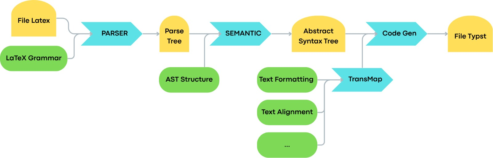

# LaTeX-To-Typst

Project work for the course of Formal Language and Compilers @ Polytechinc University of Bari, 2025/2026.

## Coverage

The LaTeX features supported by this project are a subset of the ones described in
the [Overleaf documentation](https://www.overleaf.com/learn), even if not all of them are fully implemented yet:

- [x]  [Bold, italics and underlining](https://www.overleaf.com/learn/latex/Bold%2C_italics_and_underlining)
- [x]  [Text alignment](https://www.overleaf.com/learn/latex/Text_alignment)
- [x]  [Line breaks and blank spaces](https://www.overleaf.com/learn/latex/Line_breaks_and_blank_spaces)
- [x]  Comments
- [x]  [Font sizes, families, and styles](https://www.overleaf.com/learn/latex/Font_sizes%2C_families%2C_and_styles)
- [x]  [Lists](https://www.overleaf.com/learn/latex/Lists)
- [x]  [Hyperlinks](https://www.overleaf.com/learn/latex/Hyperlinks)
   - [x] `\href`
- [x]  [Sections and chapters](https://www.overleaf.com/learn/latex/Sections_and_chapters) (→ tradurre in header)
- [x]  [Tables](https://www.overleaf.com/learn/latex/Tables)
- [x]  [Positioning Images and Tables](https://www.overleaf.com/learn/latex/Positioning_images_and_tables)
- [x]  [Code listing](https://www.overleaf.com/learn/latex/Code_listing) (simplified)
- [-]  [Mathematical expressions](https://www.overleaf.com/learn/latex/Mathematical_expressions)
    - [ ]  [Fractions and Binomials](https://www.overleaf.com/learn/latex/Fractions_and_Binomials)
    - [ ]  [Aligning equations](https://www.overleaf.com/learn/latex/Aligning_equations_with_amsmath)
    - [ ]  [List of Greek letters and math symbols](https://www.overleaf.com/learn/latex/List_of_Greek_letters_and_math_symbols)
- [-]  [Using colors in LaTeX](https://www.overleaf.com/learn/latex/Using_colours_in_LaTeX) (`xcolor` package with basic colors)
   - [x] `\textcolor`
   - [ ] `\color`
  
Other features not in list won't be supported by design, such as:

- [References and citations](https://www.overleaf.com/learn/latex/Bibliography_management_in_LaTeX)
- Macros

# Architecture



## Usage

Follow these steps to run the transpiler on your LaTeX documents:

1. **Prerequisites**: 
   - Ensure you have [Rust](https://www.rust-lang.org/tools/install) installed.
   - For automatic PDF generation and preview, install the [Typst CLI](https://github.com/typst/typst).

2. **Install Dependencies**:
   Navigate to the project root and run:
   ```bash
   cargo build
   ```
   This will automatically download and compile all required crates (such as `pest`, `chrono`, and `log`) listed in `Cargo.toml`.

3. **Prepare Input**: Place your `.tex` files in the `Assets/Input/` directory.

4. **Run the Transpiler**:
   Execute the following command:
   ```bash
   cargo run
   ```
   *(Note: `cargo run` also automatically installs missing dependencies before executing.)*

5. **Check Results**: The translated files and intermediate analysis results will be available in the `Assets/Output/` directory:
   - `<filename>.typ`: The translated Typst source code.
   - `<filename>_ParseTree.txt`: Debug representation of the PEST lexical analysis.
   - `<filename>_AST.txt`: Representation of the Abstract Syntax Tree.

6. **Live Preview**: The software automatically triggers `typst watch` on the generated `.typ` files. This allows you to see the rendering results in real-time if you have the Typst CLI installed.
